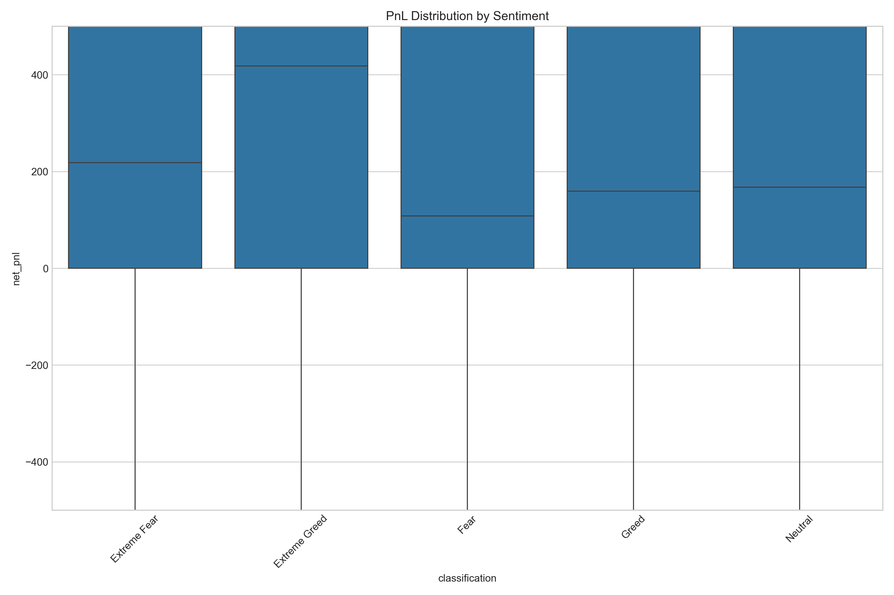
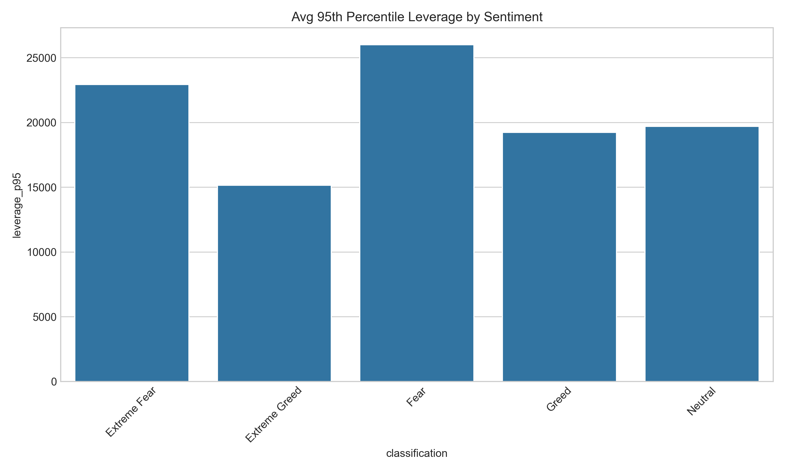
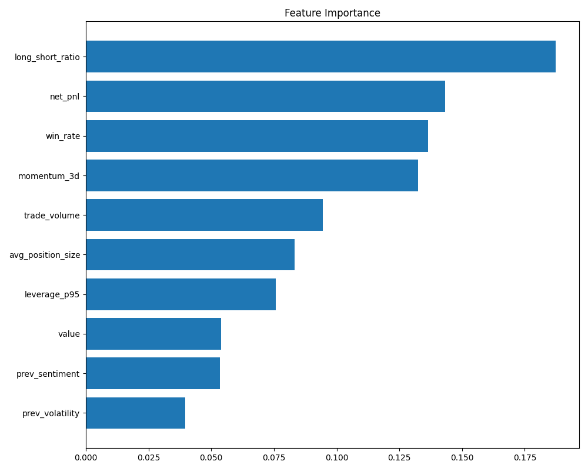

# Bitcoin Sentiment & Trader Behavior Analysis

## Project Overview
This repository contains a quantitative analysis pipeline correlating Bitcoin market sentiment (Fear vs. Greed) with trader behavior on Hyperliquid. The objective was to determine if sentiment creates predictable inefficiencies in retail trading performance.

The analysis processes over **200,000 trade logs** to generate behavioral clusters, risk metrics, and a predictive model for next-day profitability.

## Key Findings (The Alpha)
Analysis of **2,341 daily account records** revealed a distinct "Contrarian Edge":

1. **The Fear Premium**
   Traders demonstrated significantly higher profitability during "Fear" regimes compared to "Greed".
   - **Fear Avg PnL:** $5,328
   - **Greed Avg PnL:** $3,378
   - *Insight:* A **+57% excess return** exists for contrarian capital allocation during negative sentiment periods.

   

2. **The Leverage Paradox**
   Contrary to expectations of risk-off behavior during panic, retail leverage utilization peaked during Fear regimes (Avg: **~26,000x**). This suggests high-conviction counter-trend positioning rather than capitulation.

   

3. **Predictive Modeling**
   A Random Forest classifier trained on lagged behavioral features achieved **68.7% Precision** in predicting next-day profitability.
   - *Context:* This significantly outperforms the random baseline (~50%), indicating that **trader skill is "sticky"** (consistent winners tend to keep winning regardless of sentiment).
   - *Top Features:* `win_rate` (Skill) and `long_short_ratio` (Positioning) outweighed sentiment volatility.

   

## Strategy Recommendations
Based on these findings, I propose two algorithmic rules for a meta-strategy:

1. **The "Dip Sniper" Allocation**
   - **Rule:** Increase capital allocation by **20%** when the Fear & Greed Index drops below 40.
   - **Data Backing:** Historical performance in this zone is 57% higher than in Greed zones.

2. **Volatility Dampening**
   - **Rule:** Enforce strict leverage caps (max 20,000x) during Fear regimes.
   - **Data Backing:** While returns are higher, the average leverage of 26,000x during Fear introduces extreme liquidation risk that must be algorithmically managed.

## Methodology
- **Data Engineering:** Implemented a time-aware ETL process (`process_market_data.py`) using **Left Join + Forward Fill** to align daily sentiment indices with high-frequency trade logs without data leakage.
- **Clustering:** Applied **K-Means Clustering** to segment traders into three archetypes based on normalized volume, leverage, and win rate vectors.
- **Robust Validation:** Model evaluation utilized **TimeSeriesSplit (3-fold)** rather than random K-Fold to strictly prevent **look-ahead bias**, ensuring the 68.7% precision is realistic for live trading.

## Project Structure
- `src/process_market_data.py`: ETL pipeline. Cleans, aggregates, and merges raw datasets.
- `src/analyze_market_behavior.py`: Statistical analysis and strategy rule generation.
- `src/predict_alpha.py`: Machine learning pipeline (Random Forest) for alpha detection.
- `src/dashboard.py`: Streamlit interface for interactive data exploration.
- `data/`: Directory for raw and processed parquet files.
- `output/`: Generated plots and trained model artifacts.

## Setup and Execution

1. **Environment**
   pip install -r requirements.txt

2. **Data Pipeline**
   Generates the aggregated parquet file.
   python src/process_market_data.py

3. **Analysis & Visualization**
   Runs statistical tests and exports charts to `output/plots`.
   python src/analyze_market_behavior.py

4. **Model Training**
   Trains the classifier and outputs performance metrics.
   python src/predict_alpha.py

5. **Dashboard**
   Launches the local analytics server.
   streamlit run src/dashboard.py

## Dependencies
- pandas
- numpy
- scikit-learn
- seaborn
- streamlit
- plotly
- pyarrow